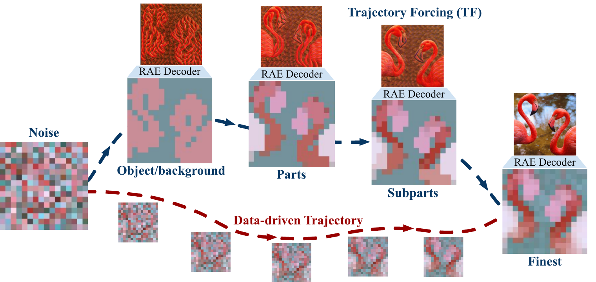

<h1 align="center">Trajectory Forcing: Structure-First Generation with Controllable Semantic Trajectories</h1>

<p align="center">
  <a href="https://mervekocabas.github.io/TrajectoryForcing/">[Project Page]</a>
  <a href="">[Paper]</a>
  <a href="https://huggingface.co/mervekocabas/TrajectoryForcing/tree/main">[Models]</a>
  <a href="https://colab.research.google.com/drive/1CZgGT1rEJ5nQ2D8fLYRyTqUIvLpwzCSP?usp=sharing">[Colab]</a>
</p>

<p align="center">
  🎉 <strong>Trajectory Forcing has been accepted to ECCV 2026!</strong>
</p>

<p align="center">
  
</p>

> **TL;DR:** Trajectory Forcing (TF) generates images by following a learned
> coarse-to-fine trajectory through a hierarchical latent space — from
> object/background to parts to subparts to the finest tokens — trained with a
> mean-flow objective in a pretrained RAE latent space.

This is the JAX implementation of **TrajectoryForcing (TF)**. TF builds on the
[Pixel Mean Flows (pMF)](https://github.com/Lyy-iiis/pMF) training framework and
performs generation in a **hierarchical latent space** produced by a pretrained
representation encoder/decoder (the [RAE](https://github.com/bytetriper/RAE)
encoder–decoder). The code is implemented in JAX and was developed and run on GPUs (8xB200).

## Pipeline overview

TF works in three stages:

1. **Encode** — turn ImageNet images into hierarchical latents with the encoder
   in [`data_prep/`](data_prep). These latents form the training
   dataset (`dataset.kind: latent_hier`).
2. **Train** — train the `pmfDiT` model on those latents using the mean-flow
   objective. See [`configs/TF_B_config.yml`](configs/TF_B_config.yml).
3. **Decode & evaluate** — sample latents from the trained model and decode them
   back to pixels with the RAE decoder in
   [`third_party/rae_decoder/`](third_party/rae_decoder), then compute FID/IS.

## Installation

Install the dependencies (JAX on GPU). Log in to WandB to track
experiments if you enable it.

```bash
bash scripts/install.sh                 # creates .venv and installs dependencies
source .venv/bin/activate               # activate before training / eval
# optional, only if logging.use_wandb is True
wandb login YOUR_WANDB_API_KEY
```

The pinned dependencies are also listed in [`requirements.txt`](requirements.txt).
Note that JAX is installed with the CUDA 12 GPU extra
(`pip install -U "jax[cuda12]==0.4.36"`, handled by `scripts/install.sh`), which
pulls the matching `jaxlib` and CUDA wheels.

### Pretrained models

- **TF model checkpoints** — released on
  [`mervekocabas/TrajectoryForcing`](https://huggingface.co/mervekocabas/TrajectoryForcing/tree/main).
  The TF-B checkpoint is available as
  [`TF_B`](https://huggingface.co/mervekocabas/TrajectoryForcing/blob/main/TF_B);
  point `load_from` in [`configs/eval_config.yml`](configs/eval_config.yml) at the
  downloaded file to evaluate. 
- **DINOv2 encoder** — downloaded automatically from HuggingFace the first time
  `data_prep` runs (no manual step; just needs network access).
- **RAE decoder + latent stats** — needed to decode samples back to pixels
  (evaluation, and FID/sampling during training). These are **auto-downloaded
  from HuggingFace on first use** if missing under `checkpoints/rae/` (from the
  public [`nyu-visionx/RAE-collections`](https://huggingface.co/nyu-visionx/RAE-collections)),
  so eval/inference works out of the box. To pre-fetch them explicitly (e.g.
  offline later, or to control timing):

  ```bash
  bash scripts/download_models.sh                 # -> checkpoints/rae/, ViTXL (default)
  # other decoder sizes (need a matching config.json under
  # third_party/rae_decoder/configs/<SIZE>/ and eval_config.yml updated):
  # SIZE=ViTL bash scripts/download_models.sh
  ```

  Only the DINOv2-B ViT-XL decoder and its ImageNet stats are pulled by
  default — that's what `configs/eval_config.yml` points at, and what the
  in-tree `third_party/rae_decoder/configs/ViTXL/config.json` matches. The
  large DiT models in the same HF collection are not fetched. Auto-download
  can be disabled with `rae_decoder.auto_download: false`.

## Data preparation

TF trains on hierarchical latents encoded from ImageNet. Place (or symlink)
the dataset at `data/imagenet/train/<wnid>/*.JPEG` — that's the default
`base_dir` in
[`data_prep/configs/choose_encoder.yaml`](data_prep/configs/choose_encoder.yaml).
Change `base_dir` / `out_root` there if you want different locations. Then run
the multi-GPU wrapper:

```bash
bash scripts/preprocess_data.sh        
```

This encodes each image into the 4-level latents
(`objbg_ids` → `parts_ids` → `subparts_ids_global` → `z`) that training
consumes, archived as sharded `.tar` files under `out_root/<split>/` with a
`.latent_sample_index.pkl` manifest. Point the training config's
`dataset.root` at `out_root`. The script auto-detects GPUs from
`CUDA_VISIBLE_DEVICES` / `nvidia-smi` and works for any GPU count.

**Recommended hardware: 8 GPUs + 64 CPUs (8 CPU per GPU)** — full
ImageNet train encodes in **~18-20 min** on this shape. Aim for at least
8 CPU per GPU; on CPU-starved nodes (e.g. 8 GPU × 8 CPU) single-GPU on the
same total CPU budget is faster.

See **[`data_prep/README.md`](data_prep/README.md)** for the full guide — input
layout, encoder configuration, hardware sizing details, the output format,
and the 4-level hierarchy.

## Configuration

The `configs/TF_*_config.yml` files are in the format of original pixel-space pMF configs.

Before running, replace the remaining placeholders in the config you use
(`dataset.root` is already pre-filled to `preprocessed_data/train`):

```yaml
fid:
    cache_ref: FID_CACHE_REF # path to your FID statistics file

logging:
    use_wandb: False
    wandb_project: 'YOUR PROJECT'
    wandb_entity: 'YOUR ENTITY'
```

## Training

1. Update `fid.cache_ref` and the WandB fields in the config for the model
   you're training (e.g. [`configs/TF_B_config.yml`](configs/TF_B_config.yml)
   or [`configs/TF_L_config.yml`](configs/TF_L_config.yml)). Checkpoints land
   under `outputs/<timestamp>_<jobname>/` and logs under
   `logs/training/<timestamp>_<jobname>/` — edit `OUT_DIR` / `LOG_DIR` at the
   top of [`scripts/train.sh`](scripts/train.sh) if you want them elsewhere.
2. Launch training:

   ```bash
   bash scripts/train.sh JOB_NAME [MODEL]
   ```

   The first argument is the job name; the optional second argument is the
   model variant (`TF_B`, `TF_L`, or `TF_H`), which selects
   `configs/<MODEL>_config.yml`. It defaults to `TF_B` when omitted. For
   example, to train the **L** model:

   ```bash
   bash scripts/train.sh train_L TF_L
   ```

## Post-training (FD loss)

Optionally post-train a trained TF checkpoint with a **Fréchet-Distance (FD)
loss** to further improve sample quality:

```bash
bash third_party/fd_loss/configs/post_train_L.sh /path/to/run/ckpt
```

The exported flax checkpoint (written under `tf_checkpoint/`) can be dropped
straight into evaluation or the interactive editing env — just point `load_from`
at the file; any checkpoint filename works. See
[`third_party/fd_loss/README.md`](third_party/fd_loss/README.md) for more.

## Evaluation

1. Configure [`configs/eval_config.yml`](configs/eval_config.yml) (the RAE
   decoder is auto-downloaded on first use — see
   [Pretrained models](#pretrained-models)):
   - `model_str` — model size e.g. pmfDiT_B_16, pmfDiT_L_16 
   - `fid.cache_ref` — path to your FID statistics file (`FID_CACHE_REF`).
   - `load_from_folder` — directory of checkpoints to evaluate
     (`LOAD_FROM_FOLDER`).

   The RAE decoder paths (`pretrained_decoder_path`, `normalization_stat_path`)
   already default to the files fetched by `scripts/download_models.sh`, and
   `decoder_config_path` points at the in-repo
   [`third_party/rae_decoder/configs/ViTXL`](third_party/rae_decoder/configs/ViTXL).

2. Launch evaluation:

   ```bash
   bash scripts/eval.sh JOB_NAME
   ```

   This runs `main.py` with `--config=configs/load_config.py:eval`, samples
   latents, decodes them with the RAE decoder, and reports FID/IS.

You can also compute FID reference statistics yourself with
[`prepare_ref.py`](prepare_ref.py).

## Interactive editing

[`editing_env/`](editing_env) contains a small Gradio app for **interactive
latent token-exchange editing**: generate a reference and a target from ImageNet
classes, copy latent tokens between them across the coarse→fine hierarchy levels,
and regenerate to see the edited result. It uses the dedicated `TF_L_edit`
checkpoint (auto-downloaded from
[`mervekocabas/TrajectoryForcing`](https://huggingface.co/mervekocabas/TrajectoryForcing/blob/main/TF_L_edit))
and the config [`configs/edit_env_config.yml`](configs/edit_env_config.yml).

```bash
cd editing_env
./run.sh             # serves http://0.0.0.0:7860 (Gradio default; pass an arg for another port)
```

See **[`editing_env/README.md`](editing_env/README.md)** for the full guide.

https://github.com/user-attachments/assets/1ddb36e1-f458-4ee9-aff8-05894a052f9b

▶️ If the video does not render inline, open
[`assets/editing_env_demo.mp4`](assets/editing_demo.mp4) directly.

## Repository structure

```
configs/            # default.py base config + YAML overrides (TF, eval, edit_env)
data_prep/          # encoder that turns images into hierarchical latents
editing_env/        # interactive Gradio app for latent token-exchange editing
models/             # pmfDiT model and building blocks
third_party/
├── rae_decoder/    # RAE decoder used to map latents back to pixels
└── fd_loss/        # FD-loss post-training (see third_party/fd_loss/README.md)
utils/              # data pipeline, FID, EMA, checkpointing, logging, ...
main.py             # entry point (train / evaluate)
train.py            # training and evaluation loops
pmf.py              # mean-flow objective and model wrapper
prepare_ref.py      # compute FID reference statistics
scripts/            # install / download_models / preprocess_data / train / eval launchers
```

## Citation

If you find this work useful in your research, please consider citing it:

```bib
@inproceedings{kocabas2026trajectoryforcing,
  author    = {Kocabas, Merve and Gao, Gege and Sch\"olkopf, Bernhard and Geiger, Andreas},
  title     = {Trajectory Forcing: Structure-First Generation with Controllable Semantic Trajectories},
  booktitle = {Proc. of the European Conference on Computer Vision (ECCV)},
  year      = {2026},
}
```

TrajectoryForcing builds directly on prior open-source work:
- **[Pixel Mean Flows (pMF)](https://github.com/Lyy-iiis/pMF)** — the base
  training framework and `pmfDiT` model that this repository is built on.
- **[RAE](https://github.com/bytetriper/RAE) encoder–decoder** — the
  representation encoder (`data_prep/`) and decoder
  (`third_party/rae_decoder/`) used for latent-space generation.

